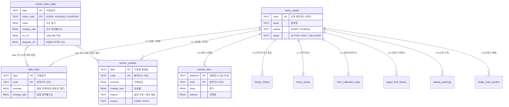

# 한국 주식 퀀트 트레이딩 시계열 데이터베이스 명세서 (Quant Market Database Spec)

본 문서는 한국 주식 시장(KOSPI, KOSDAQ)의 전 기간 시계열 데이터 및 보조지표, 주도주/기준봉 매매 전략을 위한 고성능 로컬 SQLite 데이터베이스(`quant_market.db`)의 11대 핵심 테이블 스키마, 관계도(ERD), 그리고 실전 퀀트 활용 명세서입니다.

---

## 1. 11대 핵심 테이블 총괄 현황

| 번호 | 테이블명 | 한글 명칭 | 데이터 규모 | 기본키 (PK) | 핵심 역할 |
| :---: | :--- | :--- | :---: | :--- | :--- |
| **1** | **`stock_master`** | 종목 마스터 | 2,767건 | `code` | 전 종목 메타데이터 & 상폐 관리 (생존 편향 방지) |
| **2** | **`daily_ohlcv`** | 일봉 시계열 | 11,611,717건 | `(date, code)` | 40년 치 전 종목 일봉, 원화 거래대금, 등락률 |
| **3** | **`minute_ohlcv`** | 2분봉 시계열 | 4,411,842건 | `(datetime, code)` | 주도주 92개 종목의 1~1.3년 치 고빈도 타점 데이터 |
| **4** | **`min2_collection_meta`** | 분봉 수집 메타 | 92건 | `ticker` | 분봉 수집 구간 관리 및 단 1회 호출 증분 수집 기준점 |
| **5** | **`focus_stocks`** | 집중 관심 종목 | 44건 | `ticker` | S/A/B 등급 관리, 테마 키워드, 광기 종목(`frenzy_yn`) 관리 |
| **6** | **`frenzy_history`** | 광기/초급등 이력 | 30건 | `(ticker, start_date)` | 역사적 1~3차 대파동 이력(최대 상승률, 파동 최고가) |
| **7** | **`anchor_candles`** | 기준봉 관리 | 준비 완료 | `(date, code)` | 트레이더 선별(`USER`)+기계 추출(`AUTO`) 기준봉 & 발생 이유 |
| **8** | **`market_index_daily`** | 시장 지수 시계열 | 25,331건 | `(date, index_code)` | 코스피/코스닥/200 40년 지수, 14일 RSI, 20일 이격도 |
| **9** | **`upper_limit_history`** | 상한가 도달 이력 | 스키마 완비 | `(date, code)` | 상한가 도달 요약 (대용량 일봉 스캔 방지 100배 가속) |
| **10** | **`market_warnings`** | 시장 조치 이력 | 스키마 완비 | `(date, code, type)` | 투자경고/주의/관리종목 등 리스크 종목 필터링 |
| **11** | **`single_price_auction`** | 단일가 매매 기간 | 스키마 완비 | `(code, start_date)` | 30분 단일가 매매 구간 (알고리즘 오작동 방지 필터) |

---

## 2. 테이블 간 관계도 (Entity-Relationship Diagram)

---

## 3. 테이블별 상세 역할 및 실전 퀀트 사용 용도

### [중심 기준 엔터티]
#### 1) `stock_master` (종목 마스터 및 생존 관리)
* **스키마**: `code(PK)`, `name`, `market`, `status`
* **역할 및 관계**: 모든 개별 주식 테이블의 부모(Parent) 엔터티 (외래키 참조).
* **실전 사용 용도**:
  - 종목코드 6자리와 한글 종목명을 표준화 매핑.
  - 상장폐지 종목(`status='DELISTED'`)을 삭제하지 않고 보존하여 **과거 시점 백테스팅 시 생존 편향(Survivorship Bias)을 원천 차단**.

---

### [대용량 시계열 저장소]
#### 2) `daily_ohlcv` (일봉 시계열 - 1,161만 행)
* **스키마**: `date(PK)`, `code(PK)`, `open`, `high`, `low`, `close`, `volume`, `turnover`, `change_rate`
* **인덱스**: `idx_daily_code_date ON (code, date)`
* **역할 및 관계**: `stock_master`와 1:N 연결. 대한민국 주식 시장 40년 치 전수 시계열 저장소.
* **실전 사용 용도**:
  - **`turnover`(원화 환산 거래대금)**: 런타임 계산 부하 없이 거래대금 50억~100억 이상 유동성 필터링을 직접 쿼리 최적화.
  - **`change_rate`(수정주가 기준 당일 등락률)**: 급등주 및 장대양봉 모멘텀 스크리닝 가속.
  - 기준봉 발생 후 D+1 ~ D+20 기간 동안의 주가 시뮬레이션(눌림목 타점 도달 여부, 반등 최고가, 최대 낙폭) 산출.

#### 3) `minute_ohlcv` (2분봉 고빈도 시계열 - 441만 행)
* **스키마**: `datetime(PK)`, `code(PK)`, `open`, `high`, `low`, `close`, `volume`
* **인덱스**: `idx_minute_code_datetime ON (code, datetime)`
* **역할 및 관계**: `stock_master`와 1:N 연결. 주도주 92개 종목의 1년 치 고빈도 봉 데이터.
* **실전 사용 용도**:
  - **장중 세부 수급 분석**: 일봉상 윗꼬리 장대양봉이 발생했을 때 오전 9시 30분 돌파 수급인지 장 막판 설거지 수급인지 분 단위 정밀 분석.
  - **초단타/눌림목 타점 검증**: 기준봉 중심값 도달 시 2분봉상 이중 바닥(W패턴) 형성 후 반등 여부를 체크하는 마이크로 진입 알고리즘 검증.

---

### [전략 및 이벤트 특화 테이블]
#### 4) `anchor_candles` (기준봉 시계열 및 발생 사유)
* **스키마**: `date(PK)`, `code(PK)`, `turnover`, `change_rate`, `reason`, `source`, `open`, `high`, `low`, `close`
* **인덱스**: `idx_anchor_code_date ON (code, date)`, `idx_anchor_source ON (source)`
* **역할 및 관계**: `stock_master`와 1:N 연결, `daily_ohlcv` 및 `market_index_daily`와 `date`로 조인.
* **실전 사용 용도**:
  - **정성적 테마 백테스트 (`reason`)**: AI 수주, 바이오 임상, 경영권 분쟁 등 재료별 기준봉 눌림목 반등 승률 비교.
  - **트레이더 알파(Alpha) 검증 (`source`)**: 트레이더가 직접 눈으로 선별한 고순도 종목(`USER`)과 기계식 대규모 추출 종목(`AUTO`)을 분리하여, 인간의 테마 선별 안목이 만들어내는 초과 수익률을 정량적으로 증명.
  - 캔들 4종(`open, high, low, close`)을 사전 탑재하여 1,161만 행 재조인 없이 중심값((H+L)/2), 3등분선, 시가 손절선 등을 0.001초 만에 연산.

#### 5) `market_index_daily` (시장 지수 및 거시 지표 - 2.5만 행)
* **스키마**: `date(PK)`, `index_code(PK)`, `open`, `high`, `low`, `close`, `volume`, `turnover`, `change_rate`, `rsi_14`, `ma20`, `ma60`, `disparity_20`
* **인덱스**: `idx_index_code_date ON (index_code, date)`, `idx_index_rsi ON (index_code, rsi_14)`
* **역할 및 관계**: 모든 개별 주식 시계열과 `date`를 매개로 N:1 결합되는 독립 거시 테이블.
* **실전 사용 용도**:
  - **시장 과매도 투매 반등 전략**: `WHERE KOSDAQ.rsi_14 <= 30` (지수 극단 과매도) 구간에서 발생한 주도주 기준봉만 공략하는 역발상 매매.
  - **하락장 매매 필터 (계좌 방어)**: 지수가 20일선 아래(`disparity_20 < 100`)인 역배열 하락장일 때는 매수 신호를 원천 차단하여 MDD 통제.

#### 6) `focus_stocks` (주도주 추적 관리) & `frenzy_history` (광기 이력)
* **역할 및 관계**: `stock_master`와 1:1 및 1:N 연결.
* **실전 사용 용도**:
  - `focus_stocks`: S/A/B 등급별 포트폴리오 비중 차등화, 광기 종목(`frenzy_yn='Y'`) 추적.
  - `frenzy_history`: 300% 이상 초급등을 보였던 30개 역사적 광기 종목의 1~3차 파동 기간을 핀포인트로 슬라이싱하여, 파동 초입 패턴 집중 머신러닝 학습 표본으로 활용.

---

### [파이프라인 및 리스크 관리 보조 테이블]
#### 7) `min2_collection_meta` (분봉 수집 워터마크)
* **실전 사용 용도**: 종목별 최신 수집 일시(`to_datetime`)를 보관하여, 매일 장 마감 후 **단 1회 API 호출(0.35초)로 당일 신규 분봉만 초고속 증분(Delta) 수집**하는 워터마크 역할.

#### 8) `upper_limit_history`, `market_warnings`, `single_price_auction`
* **실전 사용 용도**:
  - `upper_limit_history`: 상한가 종목 탐색 시 1,161만 행 풀스캔을 방지하고 100배 이상의 쿼리 가속 제공.
  - `market_warnings` & `single_price_auction`: 투자경고/주의 종목 및 30분 단일가 매매 구간 등 비정상 왜곡 캔들을 백테스트 매수 대상에서 자동 배제.

---

## 4. 실전 백테스팅 시 테이블 결합 시나리오 (예시)

> **전략명: "코스닥 지수 투매 반등 + 주도주 기준봉 중심값 눌림목 전략"**
> 
> 1. **[시장 필터]**: `market_index_daily`에서 코스닥 지수의 `rsi_14 <= 30` (과매도 구간) 날짜 추출.
> 2. **[종목 선별]**: `anchor_candles`에서 위 일자 부근에 발생한 순도 높은 기준봉(`source='USER'`, 거래대금 500억+, 상승률 15%+) 추출.
> 3. **[리스크 제외]**: `market_warnings`에 등록된 투자경고 종목 배제.
> 4. **[타점 시뮬레이션]**: `daily_ohlcv`에서 해당 종목의 D+1 ~ D+5 일봉을 가져와 기준봉 중심값((H+L)/2) 도달 시 매수 체결 및 손익비(Profit Factor) 계산.
> 5. **[정밀 분봉 확인]**: `minute_ohlcv`를 통해 매수 당일 2분봉상 저점 반등 흐름 교차 검증.

---
*Generated by Antigravity Quantitative Trading System*

* 📖 **[아키텍처 고도화 분석 보고서 바로가기 (Gemini Review & Edge Cases)](QUANT_ARCHITECTURE_REVIEW.md)**
